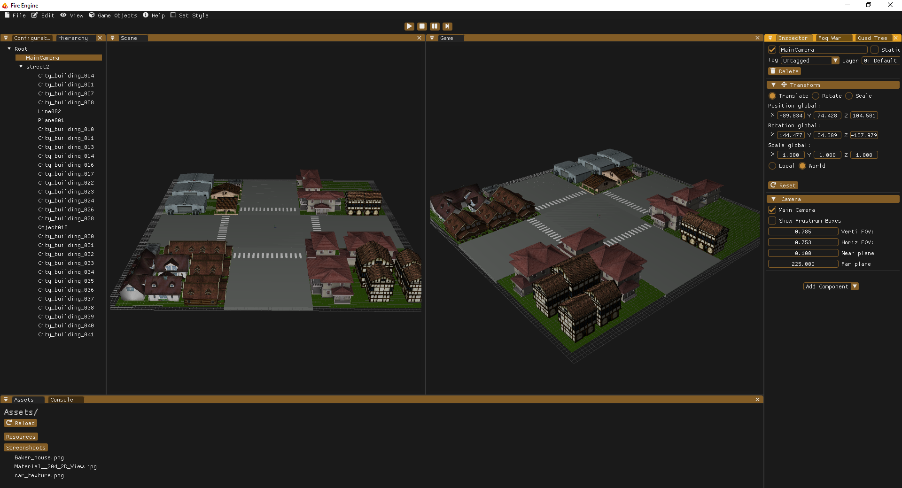
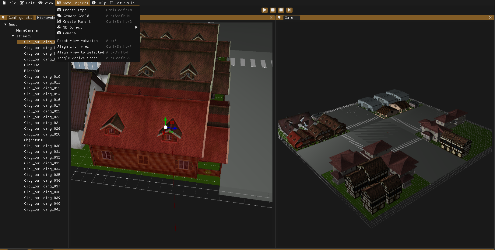

# Fire-Engine
#### About Fire Engine:
Project currently under development as part of the training of the subject "Engine Development" taken at the Polytechnic University of Catalonia" through the attached center CITM, for the degree of Design and Development of Videogames.

This engine is being developed in C++ language using the OpenGl library.

The objective of this project is to train and gain experience in memory management and code optimization.

The creation of this engine will be to provide in a direct way, a tool for the development of Project 3, which aims to develop a video game with its own engine. 

## Index
 1. [User guide:](#id.Guide)
 2. [Inside Fire-Engine:](#id.Inside)
 + 2.1. [Controls:](#id.Controls)
 + 2.2. [Components:](#id.Components)
 + 2.3. [Short Cuts:](#id.Shorts)
 + 2.4. [Configuration:](#id.Conf)
 + 2.5. [ToolBar:](#id.ToolBar)
 3. [Features](#id.Features)
 4. [About Us](#id.AboutUs)

## User guide:<a name="id.Guide">

#### Download and install Fire engine:

In the release section you will find the latest version provided by the developers. 
Inside the release you will find the executable file with .exe extension.

## Inside Fire-Engine:<a name="id.Inside">

#### Controls:<a name="id.Controls">

To move the camera we will use MOUSE_RIGHT button +:
+ "W" Scroll forward.
+ "S" Backward displacement.
+ "A" Left lateral displacement.
+ "D" Right lateral displacement.
+ "Q" Down vertical displacement.
+ "E" Up vertical displacement.
+ "F" Front view of the selected object.
+ "Alt" Orbit 
+ "Scroll mouse" Zoom in and Zoom out

 
 
You can use the mouse wheel to zoom both backwards and forwards.

To orbit you can use the right mouse button, holding and dragging the mouse button. 
Rotation with respect to an object is possible by holding ALT when an object is selected. 

#### Components:<a name="id.Components"> 
Components Info:
+ Transform 
  + Modified objects
  + Set axis Local/Global
  + Delete objects
+ Mesh Renderer
  + Enable/Disable mesh 
  + Mesh info
  + Draw bounding box and normals
+ Material
  + Texture dimension
  + Preview texture
  + Texture path
  + Active view with checkers
+ Camera
  + Set as main camera
  + Draw his frustrum boxes
  + Modified his frustrum variables

#### Short Cuts:<a name="id.Shorts">
+ The numbers 1-9 open and close the tabs
+ "Ctrl+N" New Scene
+ "Ctrl+S" Save Scene
+ "Ctrl+D" Duplicate Object
+ "Ctrl+Shift+N" New GameObject Empty
+ "Ctrl+Shift+G" New GameObject Parent
+ "Alt+Shift+N" New GameObject Child
+ "Ctrl+Shift+F" Align with view
+ "Ctrl+Alt+W" Use TranslateSnap
+ "Ctrl+Alt+E" Use RotateSnap
+ "Ctrl+Alt+R" Use ScaleSnap
+ "Alt+Shift+F" Align with selected
+ "Alt+Shift+A" Toggle active state
+ "Alt+F" ResetViewRotation

#### Configuration:<a name="id.Conf">

In the configuration section, the user will be able to modify the engine parameters according to his needs. Where you can also find the save button to save the current state of the engine. 

### ToolBar:<a name="id.ToolBar">

#### File: 
- Close the engine
- New Scene
- Save Scene
- Load Scene
- Import asset: opens file dialogue
 
#### Edit: 
- Duplicate: duplicates selected game object
- Snap options for translation, ritation and scaling

#### View:
- In view you can configure the view of the menus that you want to be active or not, according to convenience. 

#### Game Objects:
- Create Empty
- Create Child
- Create Parent
- 3D Objects (Cube, Sphere, Cylinder, Pyramid)
- Camera
- Reset View rotation
- Align With View
- Align View With Selected
- Toggle Active State

 
 
#### Help: 
In help you can find a small options section where you can activate the demo version of imGui.
- Documentation: You will be able to access the documentation.
- Download: Download the latest version.
- Report: Report any bug found.
- About Us: You will also find a section with information about the engine developers. 
 
 #### Set Style:
- You can choose your favourite on 7 different styles for the UI style to work comfortably
- You can increase or decrease popUp windows alpha
 
 
## Features:<a name="id.Features">
#### Console tab:
- Toolbar Bar: Logs type numerated
   - Clear Button
- Stacks repeated logs
 
#### Assets tab:
- Bar with current folder path
- Navigation through project's assets
- Asset deletion from inside motor
- Reload assets on the tab

#### Fog War:
- Enable and disable fog of war
- Linear or exponential fog
- Set fog color
- Set fog start and end
 
#### Quad Tree:
- Render QuadTree option
- Use Mouse Picking Option
- View quad tree data
- Set max divisions and max objects per division
- Generate quad tree

#### Inspector:
- Enable and disable components
- Buttons Add Tags and Layers
- Show all components
- Button "Add Component" 

#### Hierarchy:
- Double click to name game object or click in arrow to open game object tree 

## About us:<a name="id.AboutUs">

Alejandro Moreno Sanchez:
- @JandroK  | 
  - https://github.com/JandroK 
  - https://www.linkedin.com/in/alejandro-moreno-0b01ab1b2/

Ismael Tejada Coca:
- @IsmaUPC  | 
  - https://github.com/IsmaUPC 
  - https://www.linkedin.com/in/ismatc/
 
 Denis Deconinck Soriano:
- @Denisdrk6  | 
  - https://github.com/Denisdrk6

## License

MIT License

Copyright (c) 2021 JandroK & IsmaUPC & Denisdrk6

Permission is hereby granted, free of charge, to any person obtaining a copy
of this software and associated documentation files (the "Software"), to deal
in the Software without restriction, including without limitation the rights
to use, copy, modify, merge, publish, distribute, sublicense, and/or sell
copies of the Software, and to permit persons to whom the Software is
furnished to do so, subject to the following conditions:

The above copyright notice and this permission notice shall be included in all
copies or substantial portions of the Software.

THE SOFTWARE IS PROVIDED "AS IS", WITHOUT WARRANTY OF ANY KIND, EXPRESS OR
IMPLIED, INCLUDING BUT NOT LIMITED TO THE WARRANTIES OF MERCHANTABILITY,
FITNESS FOR A PARTICULAR PURPOSE AND NONINFRINGEMENT. IN NO EVENT SHALL THE
AUTHORS OR COPYRIGHT HOLDERS BE LIABLE FOR ANY CLAIM, DAMAGES OR OTHER
LIABILITY, WHETHER IN AN ACTION OF CONTRACT, TORT OR OTHERWISE, ARISING FROM,
OUT OF OR IN CONNECTION WITH THE SOFTWARE OR THE USE OR OTHER DEALINGS IN THE
SOFTWARE.

- Additional Licenses:
  - Hierarchy DragAndDrop from Rubén Ajenjo Rodriguez' Engine
